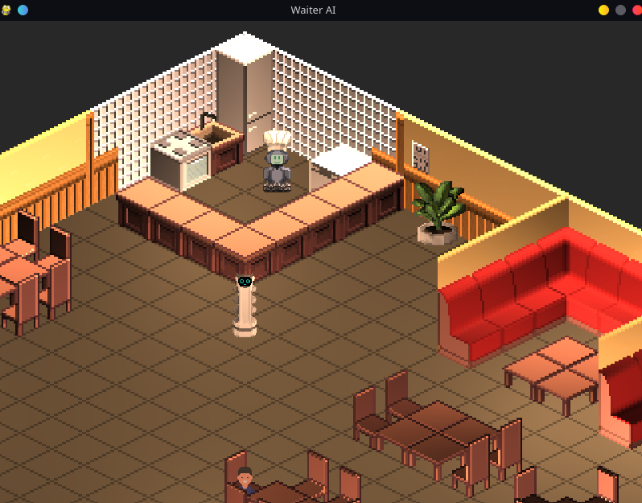

<div align=center>
  <h1>Projekt Sztuczna Inteligencjia</h1>
</div>

## Automatyczny kelner
Zadaniem automatycznego kelnera jest przyjmowanie zamówień i dostarczanie posiłków klientom. Agent
rozpoznaje przygotowany w kuchni posiłek, a następnie na postawie historii zamówień wybiera stolik, do
którego należy go dostarczyć.


<div align=center>
  <!--  -->
  
</div>


## TOC
- [Automatyczny kelner](#automatyczny-kelner)
- [TOC](#toc)
- [Installation](#installation)
- [Usage](#usage)
  - [main.py explained](#mainpy-explained)
  - [Editing Environment](#editing-environment)
  - [Editing Agents Logic and Main Logic](#editing-agents-logic-and-main-logic)
  - [Changing Assets](#changing-assets)
  - [Chaining Constants](#chaining-constants)
- [Architecture](#architecture)
  - [Main learning approach](#main-learning-approach)
  - [Agents](#agents)
- [Trade-offs](#trade-offs)
  - [Reinforcement learning vs loss function in each iteration.](#reinforcement-learning-vs-loss-function-in-each-iteration)
- [Classes](#classes)
  - [Model](#model)
    - [About](#about)
    - [Variables](#variables)
    - [Methods and Functions](#methods-and-functions)
  - [Camera](#camera)
    - [About](#about-1)
    - [Variables](#variables-1)
    - [Methods and Functions](#methods-and-functions-1)
  - [Renderer](#renderer)
    - [About](#about-2)
    - [Variables](#variables-2)
    - [Methods and Functions](#methods-and-functions-2)
  - [Grid\_Tile](#grid_tile)
    - [About](#about-3)
    - [Variables](#variables-3)
    - [Methods and Functions](#methods-and-functions-3)
  - [Grid](#grid)
    - [About](#about-4)
    - [Variables](#variables-4)
    - [Methods and Functions](#methods-and-functions-4)
  - [Wall](#wall)
    - [About](#about-5)
    - [Variables](#variables-5)
    - [Methods and Functions](#methods-and-functions-5)
  - [Object](#object)
    - [About](#about-6)
    - [Variables](#variables-6)
    - [Methods and Functions](#methods-and-functions-6)
  - [Orientation Enum](#orientation-enum)
  - [Chair inherit Object](#chair-inherit-object)
    - [About](#about-7)
    - [Variables](#variables-7)
    - [Methods and Functions](#methods-and-functions-7)
  - [Counter inherit Object](#counter-inherit-object)
    - [About](#about-8)
    - [Methods and Functions](#methods-and-functions-8)
  - [Food inherit Object](#food-inherit-object)
    - [About](#about-9)
    - [Methods and Functions](#methods-and-functions-9)
  - [Table inherit Object](#table-inherit-object)
    - [About](#about-10)
    - [Variables](#variables-8)
    - [Methods and Functions](#methods-and-functions-10)
  - [Beings inherit Object](#beings-inherit-object)
    - [About](#about-11)
    - [Variables](#variables-9)
    - [Methods and Functions](#methods-and-functions-11)
  - [Waiter inherit Beings](#waiter-inherit-beings)
    - [About](#about-12)
    - [Variables](#variables-10)
    - [Methods and Functions](#methods-and-functions-12)
  - [Client inherit Beings](#client-inherit-beings)
    - [About](#about-13)
    - [Variables](#variables-11)
    - [Methods and Functions](#methods-and-functions-13)
  - [Cook inherit Beings](#cook-inherit-beings)
    - [About](#about-14)
    - [Variables](#variables-12)
    - [Methods and Functions](#methods-and-functions-14)
  - [Conf.py file](#confpy-file)
    - [About](#about-15)
- [Prerequisites](#prerequisites)
- [Tasks:](#tasks)

---


## Installation
1. Install python and git
    ```bash
    sudo apt update
    sudo apt upgrade
    sudo apt install python3 git
    ```
2. Clone repository
    ```bash
    git clone https://git.wmi.amu.edu.pl/s500044/Sztuczna_Inteligencja_Projekt
    cd Sztuczna_Inteligencja_Projekt
    ```
3. Create env and install requirements
    ```bash
    python3 -m venv .venv
    source .venv/bin/activate
    pip install -r requirements.txt
    ```
4. Run program
    ```bash
    python3 AI/main.py 
    ```

---


## Usage
### main.py explained
  ```python
  from Classes.Model import Model # import Model

  model = Model() # model constructor
  
  # learning process with 200 steps and 2000 acceleration
  for i in range(200):
    model.modelIteration(2000)

  # showing visual model
  while(model.isRunning()):
    model.modelIteration()
    model.renderFrame()
  ```

### Editing Environment
For changing model look, table placement, chairs etc. Edit ```_initModel()``` in ```Model Class```.

### Editing Agents Logic and Main Logic
- For changing Main Logic edit ```modelIteration()``` in ```Model Class```.
- For changing Agent Logic [```Waiter```, ```Cook```, ```Client```] edit their classes ```decision()``` function.

### Changing Assets
If you want to change asset edit ```path to texture``` in each class or replace asset in ```Assets/``` folder. If error occur than we show error texture.

### Chaining Constants
If you want change any constant edit ```conf.py``` file.

---


## Architecture
### Main learning approach
- Main Execution Class is ```Model```.
- Model have initialization of Model to one constance learning model.
- Model have modelIteration one operation for example moving, ordering etc.
- modelIteration runs agents ```decisions functions```.
- Model have ```simulateDay()``` that is used for reinforcement learning.
- After ```simulateDay()``` we calculate profit function and base on this we chose better model.

### Agents
- **Cook**: main task of cook is choosing witch food we are cooking at the moment, place food on counter, getting orders from waiter (Maybe we add list on wall where we save client orders).
- **Waiter**: main task of waiter is getting orders from clients, providing orders to cook, choosing and getting food from counter. Giving food to Clients, maybe setting prices in future.
- **Client**: main task is spawning, going to tables that are free, making orders, eating, giving feedback like time they spent waiting etc. Main unit for ```Loss Function```.

---


## Trade-offs
### Reinforcement learning vs loss function in each iteration.
Reinforcement learning learning allows longer execution time so we can make two models change a bit values in decision function and chose one that perform better at the end via calculating points like client satisfaction, profit, etc. Also we can run it on threads. We can also run it as whole day.
One Iteration Loss Function requires calculating Loss Function after every iteration we made because of that calculations might be harder and model could be worse than in reinforcement learning scenario. Also when waiter goes with food to client it is harder to calculate loss function we might have to use distance. 

---


## Classes
### Model
#### About
Main function used for initialization, training and visualization. Provides one initialized model and methods for faster learning process. In learning process we skip window creation and use acceleration. 

#### Variables
  * **_running: bool**: Check if model is running if window is not initialized than remain ```True```. If window is running than running gets status from window.
  * **_initialized: bool**: Check if model is initialized. Used for lazy initialization.
  * **_collisions_objects: np.ndarray[Object]**: List of Objects for Waiter collisions.
  * **_render_objects: np.ndarray[Object]**: List of objects to render. They are sorted via distance to edge and render order before rendering.
  * **_renderer: Renderer**: renderer class. Uses lazy initialization.
  * **_grid: Grid**: grid class. Uses lazy initialization.

#### Methods and Functions
  * **__init__()**: Default constructor.
  * **__del__():** Default destructor.
  * **_initModel() -> None**: Function for model initialization. Guarantee the same training model every time.
  * **_initRenderer() -> None**: Create ```_renderer```. Uses lazy initialization.
  * **isRunning() -> bool**: Check if model is running if window is initialized than return window status.
  * **modelIteration(acceleration: float = 1.0) -> None**: Model Iteration. Is used for training and visualization. Acceleration is used for faster learning process skipping waiting time for waiter walking etc also in learning state we don't initialize window.
  * **_renderOrder() -> None**: sorts ```_render_objects``` base on distance to edge and render order if distances are equal.
  * **renderFrame() -> None**: Render frame uses culling for grid tile and objects drawing.

---

### Camera
#### About
Camera is used for world surface movement by ```Renderer```. Contains world view clamping.

#### Variables
  * **_rect: pygame.Rect**: used by ```Renderer._world_surface``` movement.
  * **_size: np.ndarray[int]**: contains window sizes.
  * **_center: np.ndarray[int]**: contains camera center position.
  
#### Methods and Functions
  * **__init__(width: int, height: int, center_x_pos: int, center_y_pos: int)**: default ```Camera``` constructor where ```width, height``` are window size and ```center_x_pos, center_y_pos``` are camera center.
  * **getCenter() -> np.ndarray[int]**: getting camera center position.
  * **getRect() -> pygame.Rect**: getting camera rect for ```world surface offset```.
  * **adjustCenter(center_x: int, center_y: int) -> None**: adjusting position of camera. After adjustment we update rect. If param is ```None``` than we treat it like 0.
  * **setCenter(center_x: int, center_y: int) -> None**: setting position of camera. After setting we update rect. If param is ```None``` than we treat it like 0.

---

### Renderer
#### About
Main rendering system. Create window, render ```world surface```, hanging events. Uses ```pygame```.

#### Variables
  * **_running: bool**: is window running.
  * **_title: str**: window title.
  * **_size: np.ndarray[int]**: window sizes.
  * **_surface: pygame.Surface**: default window surface.
  * **_world_surface: pygame.Surface**: world surface is renderer with camera offsets.
  * **_camera: Camera**: camera class used for offsetting world surface.
  * **_events: np.ndarray[pygame.event.Event]**: list of events in window.
  * **_event_keys: np.ndarray[np.int_]**: list of pressed keys in window.
  * **_clock: pygame.time.Clock**: cloak used for calculating delta time.
  * **_deltaTime: float**: delta time used for correct physic calculations.
  * **_mousePosition: np.ndarray[int]**: current window mouse position updated after click.
  * **_mouseButtonDown: bool**: left mouse button click. Resets every frame.

#### Methods and Functions
  * **__init__(title: str, width: int, height: int)**: Default ```Renderer``` constructor where title is window ```title```, ```width, height``` are window sizes.
  * **__del__():**: Default ```Renderer``` destructor.
  * **_createSurface() -> None**: create ```_surface```. Used for lazy initialization.
  * **_createWorldSurface() -> None**: create ```_world_surface```. Used for lazy initialization.
  * **_createCamera() -> None**: create ```_camera```. Used for lazy initialization.
  * **_pollEvents() -> None**: fetching window events. Checking if window is running. Than we run ```_cameraEvents(), _mouseEvents()```.
  * **_mouseEvents() -> None**: getting ```_mouseButtonDown, _mousePosition``` in current frame.
  * **_cameraEvents() -> None**: adjusting camera center with clamping.
  * **backgroundColor(color: np.ndarray[int]) -> None**: Render background color where color is ```vec3``` of colors ```RGB```.
  * **renderFrame() -> None**:  ```swap buffer```, ```render world surface``` with ```camera offsets```, calculate ```delta time```, ```_pollEvents()```.
  * **getSurface() -> pygame.Surface**: get ```world_surface```.
  * **getMouse() -> np.ndarray[int]**: get mouse ```vec2``` if pressed. If no press on window than return ```None```.
  * **getDeltaTime() -> float**: getting delta time for physics.
  * **getRunning() -> bool**: checking if window is running.
  * **getCamera() -> Camera**: getting camera for world offset calculations like getting press position.

---

### Grid_Tile
#### About
Single tile in isomeric space. Created with diamonds. Diamonds are created with ```center position``` and ```diagonal length```. 

#### Variables
  * **center_x**: x center of tile.
  * **center_y**: y center of tile.
  * **a**: half diagonal of diamond.
  * **top_corner**: top corner ```vec2``` of diamond.
  * **right_corner**: right corner ```vec2``` of diamond.
  * **bottom_corner**: bottom corner ```vec2``` of diamond.
  * **left_corner**: left corner ```vec2``` of diamond.
  * **isometric_x**: grid matrix x position.
  * **isometric_y**: grid matrix y position.

#### Methods and Functions
  * **__init__(center_x, center_y, a, isometric_x, isometric_y)**: Default constructor where ```center_x, center_y``` are center of tile. ```isometric_x, isometric_y``` are grid matrix position. 
  * **__del__()**: Default destructor.
  * **isHovered(mouse_pos: np.ndarray[int], camera : Camera) -> bool:**: checking if tile is hovered.
  * **getRenderPos() -> np.ndarray[int]**: get left bottom corner where sprite should be renderer in isometric space.
  * **draw(target_surface: pygame.Surface) -> None**: Draw tile.
  * **isVisible(renderer: Renderer) -> bool**: Check if tile is visible in window. Used for culling.

---

### Grid
#### About
Grid system in isometric space. Uses ```Grid_Tile```. Render with culling.

#### Variables
  * **_size: np.ndarray[int]**: grid size ```x tiles``` on ```y tiles``` matrix.
  * **_grid_tile_size: int**: one tile size.
  * **_margins: np.ndarray[int]**: vertical and horizontal margins. 
  * **_grid_nodes: np.ndarray[np.ndarray[int]]**: matrix with elements ```vec2``` that is surface position.
  * **_grid_tiles: np.ndarray[np.ndarray[Grid_Tile]]**: matrix of tiles. 
  * **_walles: np.ndarray[Wall]**: list of walls.

#### Methods and Functions
  * **__init__(size_x: int, size_y: int, grid_tile_size : int, margin_horizontal : int, margin_vertical: int)**: Default constructor where ```size_x, size_y``` are amount of tiles in each axis. ```margin_horizontal, margin_vertical``` are offsets. After initialization we run ```_generateGridNodes(), _generateGridTails()```.
  * **__del__()**: Default destructor.
  * **_generateGridNodes() -> None**: Generates matrix of nodes, edges of tiles.
  * **_generateGridTails() -> None**: Generate matrix of tiles.
  * **get_hovered_tile(mouse_pos: np.ndarray[int], camera : Camera) -> Grid_Tile:**: getting hovered tile.
  * **draw(renderer: Renderer) -> None**: render grid with walls.

--- 

### Wall
#### About
Background Walls in isometric space.

#### Variables
  * **_Grid_Node_1**: start node.
  * **_Grid_Node_2**: end node.
  * **_height**: height of wall.

#### Methods and Functions
  * **__init__(Grid_Node_1 : np.ndarray[int], Grid_Node_2 : np.ndarray[int], height : int)**: Default constructor where ```Grid_Node_1, _Grid_Node_2``` are wall edges and height.
  * **draw(surface: pygame.Surface) -> None**: Render wall.

---

### Object
#### About
Main Object class that other ```Static and Beings``` inherit. Contains main functions for rendering.

#### Variables
  * **_position: np.ndarray[int]**: Object position on gird.
  * **_size: np.ndarray[int]**: Object size in grid tiles sizes.
  * **_offset: np.ndarray[int]**: Object render offset. For no isometric assets.
  * **_render_order: int**: Render order is used when distances to origin are the same.
  * **_texture_path: str**: Path to object texture. If texture didn't exists than we use default error texture.
  * **_texture: pygame.Surface**: ```pygame``` texture.

#### Methods and Functions
  * **__init__(render_order: int, texture_path: str, position: np.ndarray[int], offset: np.ndarray[int] = np.array([0, 0], dtype=int), size: np.ndarray[int] = np.array([1, 1], dtype=int)):**: Default Object constructor.
  * **_isVisible(grid_tile: Grid_Tile, renderer: Renderer) -> bool**: Checking if object is visible used for culling.
  * **render(surface: pygame.Surface, grid : Grid, renderer: Renderer) -> None**: render object on world surface.
  * **setPosition(position: np.ndarray[int]) -> None**: Set object position on gird.
  * **setSize(size: np.ndarray[int]) -> None**: Set object size in tiles size.
  * **setTexture(texture_path: str) -> None**: Set object texture. If texture didn't exists than use default error texture.
  * **getPosition() -> np.ndarray[int]**: Get Object position.
  * **getRenderOrder() -> int**: Get Object render order.

---

### Orientation Enum
   * **NORTHEAST** = 0
   * **NORTHWEST** = 1
   * **SOUTHEAST** = 2
   * **SOUTHWEST** = 3

---

### Chair inherit Object
#### About
Basic Chair class inherit from Object. Is used by clients to seat.

#### Variables
   * **_occupied: bool**: Chair is occupied.
   * **_client: list[Client]**: Person who is seating on chair.

#### Methods and Functions
  * **__init__(position: np.ndarray[int], orientation: Orientation, render_order: int = 0)**: Default constructor. 
  * **sitClient(client: Client) -> None**: sit client on chair.
  * **free() -> None**: free chair.
  * **getClient() -> Client**: get client who is sitting on chair. 

---

### Counter inherit Object
#### About
Basic Counter class inherit from Object. Used for storing ready food.

#### Methods and Functions
  * **__init__(position: np.ndarray[int], render_order: int = 1)**: Default constructor.

---

### Food inherit Object
#### About
Basic Food class inherit from Object. Is make by Cook and placed on Counter.

#### Methods and Functions
  * **__init__(name: str, position: np.ndarray[int])**: Default constructor.

---

### Table inherit Object
#### About
Basic Table class inherit from Object. Have Chairs where clients seats.

#### Variables
  * **_occupied: bool**: for checking if table is occupied by clients.
  * **_chairs: list[Chair]**: list of chairs assigned to table.
  * **_clients: list[Client]**: list of clients assigned to table.

#### Methods and Functions
  * **__init__(position: np.ndarray[int], render_order: int = 1)**: Default constructor.
  * **seatClient(client: np.ndarray[Client]) -> None**: assign clients to table.
  * **free() -> None**: free table.
  * **addChair(chair: Chair) -> None**: Assign chair to table.
  * **removeChair(chair: Chair) -> None**: Remove chair from table.
  * **getChairs() -> list[Chair]**: Get list of chairs.
  * **getClients() -> list[Client]**: Get list of clients.

---

### Beings inherit Object
#### About
Beings is inherit Class of Object with ability of walking.

#### Variables
  * **_velocity: float**: Beings velocity used for walking.
  * **_path: np.ndarray[np.ndarray[int]]**: List of ```vec2``` grid tiles positions that provides path.
  * **_accTime: float**: accumulation of delta time used to make step.

#### Methods and Functions
  * **goTo(hovered_tile : Grid_Tile, collisions: np.ndarray[Object]) -< None**: Give Being command to walk somewhere.
  * **calculateDistance(current_position: np.ndarray[int], position: np.ndarray[int]) -> float**: Calculate distance from position to target.
  * **generatePath(current_position: np.ndarray[int], position: np.ndarray[int], collisions: np.ndarray[Object]) -> None**: Generate path uses ```A*``` algorithm.
  * **makeStep(deltaTime: float, acceleration: float) -> None**: Makes step base on acceleration, velocity, accDeltaTime and Delta time.  

---

### Waiter inherit Beings
#### About
Waiter class inherit from Beings. Agent that learn with time. His tasks are getting orders, giving orders to cook and giving food to clients.

#### Variables
   * **_carrying_name: list[Food]** = list of food that waiter is carrying.
   * **_order_list: list[Client, Food]**: list of clients orders. 

#### Methods and Functions
  * **__init__(position: np.ndarray[int], offset: np.array = [0, 0])**: Default constructor.
  * **receiveOrder(client: Client) -> None**: Get order from client.
  * **takeFood(cook: Cook) -> None**: Taking food from Cook.
  * **completeOrder() -> None**: Compleat order. After giving food to Client.
  * **getOrderList() -> list[Client, Food]**: Get list of ordered food by clients for Cook.

---  

### Client inherit Beings
#### About
Basic Client inherit form Beings. He goes to table and order food.

#### Variables
   * **_table**: Table where Client is assigned.
   * **_chair**: Chair where Client is assigned.
   * **_waiting: bool**: Is Client waiting for food.
   * **_eating: bool**: Is Client eating.
   * **_food_name: str**: Food name that Client order.

#### Methods and Functions
  * **__init__(position: np.ndarray[int], offset: np.ndarray[int] = [0, 0])**: Default constructor.
  * **assignTable(table) -> None**: Assign Client to table.
  * **makeOrder(food_name: str) -> None**: Client makes order.
  * **receiveFood() -> None**: Receive food from waiter.
  * **getFoodName() -> str**: Get food name.

---

### Cook inherit Beings
#### About
Basic Cook inherit from Beings. He makes food.

#### Variables
   * **_current_order: Food**: food that is now making.
   * **_available_counters: list[Counter]**: list of free counters.
   * **_available_food: list[Food]**: list of ready food.
   * **_food_to_make: list[Food]**: list of food to make.

#### Methods and Functions
  * **__init__(position: np.ndarray[int], counters: Counter, offset: np.array = [0, 0])**: Default constructor.
  * **takeOrderFromWaiter(waiter) -> None**: takes orders from Waiter.
  * **makeFood() -> None**: make food from ```_food_to_make```.
  * **getAvailableFood() -> Food**: get last available food.

---

### Conf.py file
#### About
Conf file contains global constants like:
  - path to assets folder
  - default texture for error
  - gird size
  - waiter velocity
  - etc.

---


## Prerequisites
- **pygame**: for rendering.
- **numpy**: for mathematical operations.

---


## Tasks:
<details>
<summary>Iteration 1</summary>

[**env 11.03.2026**](docs/lab2%20environment-task.pdf)

- [x] Init pygame and Create Window (Daniel)
- [x] Basic Object class and render (Daniel)
- [x] Add path finding A* with delta time movement. (Daniel)
- [x] Model Class (Daniel)
- [x] Render Depth (Daniel)
- [x] Docs (Daniel)
- [x] Move to isometric space. (Martyna)
- [x] Grid base world. (Martyna)
- [x] Camera Movement. (Martyna)
- [x] Inherit Classes from Object, separation and storage in variable base on type. (Adam)
- [x] Add own custom assets and level design. (Dawid)
- [x] Order system + types of food. (Dawid)

</details>

<details open>
<summary>Iteration 2</summary>

[**knowledge representation 25.03.2026**](docs/lab2%20environment-task.pdf)

- [ ] Basic decision functions for each beings [```Client```, ```Waiter```, ```Cook```]. 
- [ ] Menu and for each Food separate class.
- [ ] Spawning Clients base on free tables.
- [ ] Clean ```Client``` -> ```Chair``` -> ```Table Assignment```.
- [ ] Single Iteration base on agent decisions. 
- [ ] Progress bar for objects task doing like ```eating```, ```cooking```, etc.
- [ ] Asymmetric Grid Instead of every time square.
- [ ] Grid get neighbors including Walls and update path finding.
- [ ] Move Walls from Grid to Object.

</details>
  
<details>
<summary>Future Plans</summary>

- [ ] Group of Tables.

</details>
  