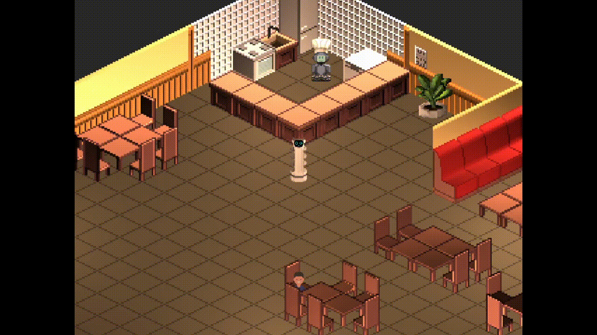

<div align=center>
  <h1>Projekt Sztuczna Inteligencjia</h1>
</div>


## Automatyczny kelner
Zadaniem automatycznego kelnera jest przyjmowanie zamówień i dostarczanie posiłków klientom. Agent rozpoznaje przygotowany w kuchni posiłek, a następnie na postawie historii zamówień wybiera stolik, do którego należy go dostarczyć.


---


<div align=center>
  
</div>


---


## TOC
- [Automatyczny kelner](#automatyczny-kelner)
- [TOC](#toc)
- [Installation](#installation)
- [Profiling](#profiling)
- [Compiling](#compiling)
- [Prerequisites](#prerequisites)
- [Tasks](#tasks)


---


## Installation
1. Install python and git
    ```bash
    sudo apt update
    sudo apt upgrade
    sudo apt install python3 git
    ```
2. Clone repository
    ```bash
    git clone https://git.wmi.amu.edu.pl/s500044/Sztuczna_Inteligencja_Projekt
    cd Sztuczna_Inteligencja_Projekt
    ```
3. Create env and install requirements
    ```bash
    python3 -m venv .venv
    source .venv/bin/activate
    pip install -r requirements.txt
    ```
4. Run program
    ```bash
    python3 AI/main.py 
    ```


---


## Profiling
```bash
python -m cProfile -o Profiler/profile.prof AI/main.py && gprof2dot -f pstats Profiler/profile.prof | dot -Tsvg -o Profiler/profile.svg
```


---


## Compiling
```bash
PYTHONPATH=AI python3 -m nuitka --standalone --onefile --enable-plugin=numpy --include-data-dir=AI/Assets=Assets --include-data-dir=Models=Models AI/main.py
```

---


## Prerequisites
- **venv**: virtual environment.
- **git**: version control.
- **pygame**: for rendering.
- **numpy**: for mathematical operations.
- **torch**: for neural network.
- **pillow**: loading assets.
- **gprof2dot**: profiling tool.
- **nuitka**: compiling to exec.


---


## Tasks
<details open>
<summary>Tasks</summary>

- [x] [Environment](docs/lab2%20environment-task.pdf) (Daniel, Martyna)
- [x] [Knowledge Representation](docs/knowledge-representation.pdf) (Adam)
- [x] [BFS](docs/lab2%20environment-task.pdf) (Dawid)
- [x] [A Star](docs/lab2%20environment-task.pdf) (Daniel)
- [x] [Decision Tree](docs/lab2%20environment-task.pdf) (Dawid)
- [x] [Neural Network](docs/lab2%20environment-task.pdf) (Adam)
- [ ] [Genetic Algorithm](docs/lab2%20environment-task.pdf) (Martyna)
</details>
  
<details>
<summary>Additional</summary>

- [x] Init pygame and Create Window (Daniel)
- [x] Renderer, Object, Beings class (Daniel)
- [x] Grid system (Martyna)
- [x] Delta time based movement (Daniel)
- [x] Main Entry and Model Class (Daniel)
- [x] Dynamic Lights (Daniel)
- [x] Isometric world (Martyna)
- [x] Grid base world (Martyna)
- [x] Camera Movement (Martyna)
- [x] Inherit Classes from Object, Separation and storage in variable base on type (Adam)
- [x] Add own custom assets and level design (Dawid)
- [x] Order system + types of food. (Dawid)
- [x] Own assets (Daniel, Martyna)
- [x] Texture system (Daniel)
- [x] Cleanups, Merging, Project structure (Daniel, Martyna) 
- [x] Docs (Daniel)
</details>